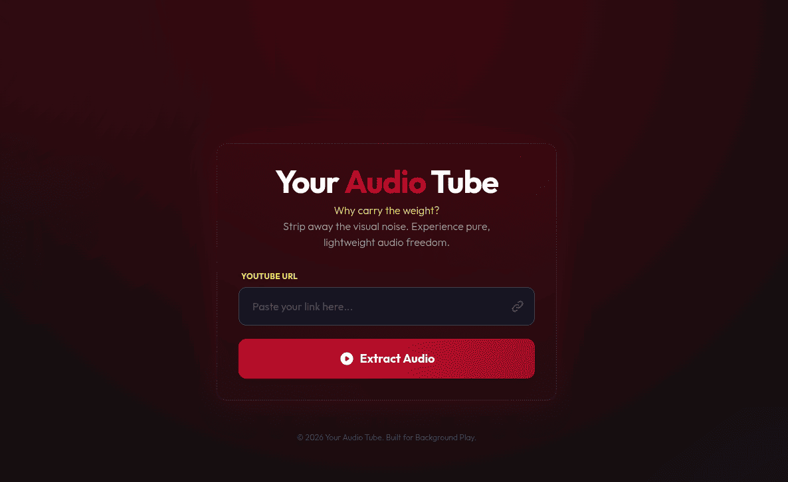

# YouTube Audio Proxy (Go)

A lightweight, high-performance Go web application that proxies YouTube audio streams. It allows users to listen to YouTube content in the background (mobile-friendly) without ads and without saving files to the server.

## Screenshots


## Features

- **Direct Stream Proxying**: Pipes audio directly from YouTube to the client using `io.Copy`. minimal memory footprint.
- **Background Play**: Uses HTML5 Media Session API to support background playback on mobile devices.
- **Privacy Focused**: No logs or files saved to disk.
- **Production Ready**: Efficient template caching and timeout handling.

## Prerequisites

- **Go**: Version 1.18 or higher.
- **yt-dlp**: Must be installed in your system PATH or placed in the root directory of the project.
  - [Download yt-dlp](https://github.com/yt-dlp/yt-dlp/releases)

## Installation

1. Clone the repository:
   ```bash
   git clone https://github.com/ohansyah/Go-Your-Audio-Tube.git
   cd Go-Your-Audio-Tube
   ```

2. Download dependencies:
   ```bash
   go mod tidy
   ```

3. (Optional) Download `yt-dlp` locally if not in PATH:
   ```bash
   curl -L https://github.com/yt-dlp/yt-dlp/releases/latest/download/yt-dlp -o yt-dlp
   chmod +x yt-dlp
   ```

## Running the Application

### Development
```bash
go run main.go
```

### Production Build
1. Build the binary:
   ```bash
   go build -o audio-proxy

2. Run the binary:
   ```bash
   ./audio-proxy
   ```
   The server will start on port `8080`.